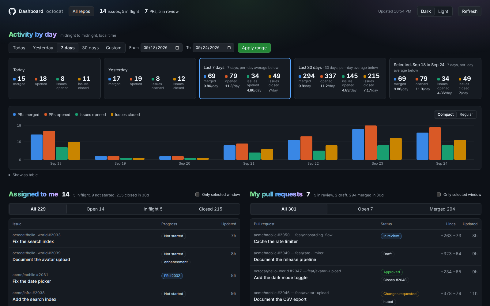

# github-dashboard

Local dashboard of your own GitHub activity: assigned issues, open PRs, and per-day opened/closed/merged counts.

Nothing personal is committed: tokens, sessions, and cached activity live in the gitignored `cache/` folder. Anyone who clones this sees their own account (via `gh auth token` on their machine) or signs in with theirs.

## Run

    ./start.sh            # starts the server if needed, opens http://localhost:4747

You are signed in automatically on this Mac via `gh auth token`.

## Share with others

Others sign in with their own GitHub account and see their own numbers. Their token is stored in `cache/sessions.json` on this machine (mode 600).

1. Put the server on the network: `HOST=0.0.0.0 ./start.sh`, then share `http://<your-lan-ip>:4747`.
2. Pick a sign-in method:
   - **Pasted token** (works now): they create a classic PAT with `repo` + `read:org` and paste it on the sign-in screen.
   - **One-click "Sign in with GitHub"**: create an OAuth App at github.com/settings/developers, tick *Enable Device Flow*, then put `GITHUB_CLIENT_ID=<client id>` in a `.env` file next to `start.sh`. No client secret is needed for device flow.

Only the owner session (localhost with `gh`) sees the "Cloned on this Mac" repo group; guests see repos from their own activity.

## Demo mode

`DEMO=1 ./start.sh` serves deterministic fake data (user `octocat`, `acme/*` repos) without touching GitHub. The README screenshot comes from this mode.

## Definitions

- Assigned issues: `assignee:me is:issue is:open`. In-flight = has an open linked PR.
- My open PRs: `author:me is:pr is:open`. In review = not draft.
- Issues opened: created by me that day. Issues closed: assigned to me, closed that day.
- PRs opened / merged: authored by me. PRs closed = closed without merge.
- Days are local midnight to midnight (server timezone).

## Configuration (`.env` next to `start.sh`, all optional)

- `HOST=0.0.0.0` to accept sign-ins from the network (default `127.0.0.1`).
- `PORT=4747`.
- `GITHUB_CLIENT_ID` for one-click device-flow sign-in.
- `REPO_ROOTS=~,~/Studio` comma-separated folders scanned for local clones (depth 6).
- `REPO_SKIP=Dropbox (Personal),TrainerRoad Dropbox` extra folder names to skip while scanning.

## Data and settings

- Past days cache per user in `cache/days-<login>.json`; today is refetched at most every 90s. A background loop keeps the last 90 days warm for every signed-in user.
- Repo filter, preset, custom range, and theme live in the browser's localStorage.
