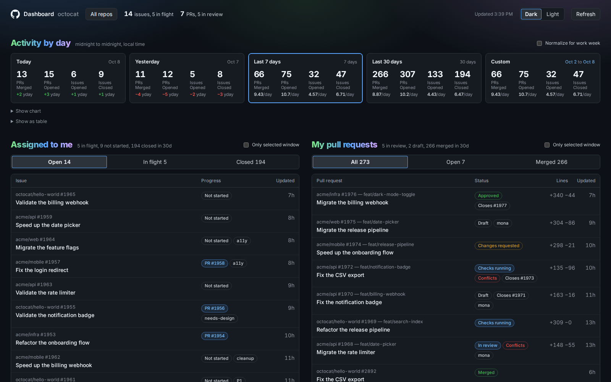
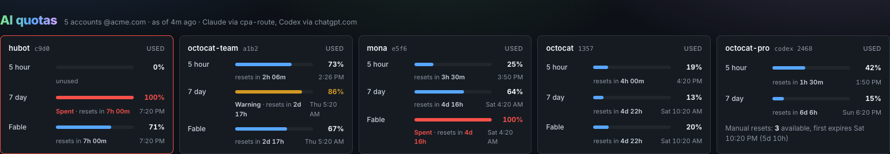

# github-dashboard

Local dashboard of your own GitHub activity: assigned issues, open PRs, per-day opened/merged counts, and (optionally) your Claude and Codex quotas.

Nothing personal is committed: tokens, sessions, and cached activity live in the gitignored `cache/` folder. Anyone who clones this sees their own account (via `gh auth token` on their machine) or signs in with theirs.

## Run

    ./start.sh            # starts the server if needed, opens http://localhost:4747

You are signed in automatically on this Mac via `gh auth token`.

## Share with others

Others sign in with their own GitHub account and see their own numbers. Their token is stored in `cache/sessions.json` on this machine (mode 600).

1. Put the server on the network: `HOST=0.0.0.0 ./start.sh`, then share `http://<your-lan-ip>:4747`.
2. Pick a sign-in method:
   - **Pasted token** (works now): they create a classic PAT with `repo` + `read:org` and paste it on the sign-in screen.
   - **One-click "Sign in with GitHub"**: create an OAuth App at github.com/settings/developers, tick *Enable Device Flow*, then put `GITHUB_CLIENT_ID=<client id>` in a `.env` file next to `start.sh`. No client secret is needed for device flow.

Only the owner session (localhost with `gh`) sees the "Cloned on this Mac" repo group; guests see repos from their own activity.

## AI quotas (optional, owner only)

If [cpa-route](https://github.com/KWedey/dev-environment) is installed, a row at the top shows each Claude account's 5-hour, 7-day, and Fable windows with their reset times. The numbers come from cpa-route's usage cache (`~/.config/cpa-route/usage-cache.json`); when it is more than 15 minutes old the dashboard runs `cpa-route ranking` in the background, which refetches under cpa-route's own rate-limit rules, and the row updates when it finishes (the page re-polls every ten seconds while a refresh is running). A Claude account whose auth file names a real organization (not "<email>'s Organization") is labelled `-team`. Codex accounts (`codex-*.json` in the same auth folder) are queried at chatgpt.com with their own token, at most every five minutes, for the rate-limit windows and the number of manual reset credits still available. `CPA_USAGE_CACHE`, `CPA_ROUTE_BIN`, and `CPA_AUTH_DIR` override the paths. Guests never see this row.

## Demo mode

`DEMO=1 ./start.sh` serves deterministic fake data (user `octocat`, `acme/*` repos) without touching GitHub. The README screenshot comes from this mode and is regenerated by a GitHub Action whenever `public/` or `demo.mjs` changes on main, which opens a PR you merge (`node scripts/screenshot.mjs` locally, needs `npm i playwright`).

## Definitions

- Assigned issues: `assignee:me is:issue is:open`. In-flight = has an open linked PR.
- My open PRs: `author:me is:pr is:open`. In review = not draft.
- Issues opened: created by me that day. Issues closed: assigned to me, closed that day.
- PRs opened / merged: authored by me.
- Pickup order: every open assigned issue gets a zone from its labels, then its title, then its first body line (`public/triage.js`). A high-priority label wins outright; otherwise tracking/feature framing, explicit decisions, critical, broken instruments, accessibility, cleanup, with correctness debt as the default. The list refetches every 2 minutes; **Refresh list** pulls it now. `node --test test/triage.test.js` pins the rules.
- Days are local midnight to midnight (server timezone).

## Configuration (`.env` next to `start.sh`, all optional)

- `HOST=0.0.0.0` to accept sign-ins from the network (default `127.0.0.1`).
- `PORT=4747`.
- `GITHUB_CLIENT_ID` for one-click device-flow sign-in.
- `REPO_ROOTS=~,~/Studio` comma-separated folders scanned for local clones (depth 6).
- `REPO_SKIP=Dropbox (Personal),TrainerRoad Dropbox` extra folder names to skip while scanning.

## Data and settings

- Past days cache per user in `cache/days-<login>.json`; today is refetched at most every 90s. A background loop keeps the last 90 days warm for every signed-in user.
- Repo filter, preset, custom range, and theme live in the browser's localStorage.
